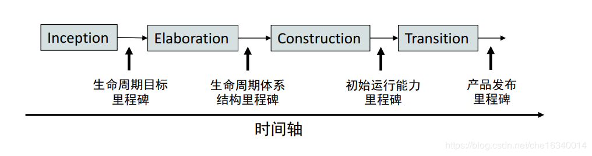

# Homework-03

软件项目过程模型与规划

## 简述瀑布模型、增量模型、螺旋模型（含原型方法），并分析优缺点

- 从项目特点、风险特征、人力资源利用角度思考

### 瀑布模型

#### 优点

- 需求很明确，定义了软件开发的基本流程与活动。

- 降低软件开发的复杂程度，提高软件开发过程的透明性，提高软件开发过程的可管理性。

- 有利于大型软件开发过程中人员的组织、管理。

#### 缺点

- 强调过程活动的线性顺序，开发过程一般不能逆转，否则代价太大。

- 瀑布模型中的软件活动是文档驱动的，当阶段之间规定过多的文档时，会极大地增加系统的工作量。

- 客户往往很难清楚地给出所有的需求，其无法解决软件需求不明确或不准确的问题。

#### 总结

该模式强调系统开发进程需有完整的规划、分析、设计、测试及文件等管理与控制，因此能有效的确保系统质量；但过程很少能够以连续由上而下的方式进行，经常会需要回到前面的阶段，或改变前一阶段的结果。

### 增量模型

#### 优点

- 将待开发的软件系统模块化，可先发布部分功能给客户，使用户可以及时了解软件项目的进展。

- 人员分配灵活。刚开始不用投入大量人力资源

- 开发顺序灵活。开发人员可以对组件的实现顺序进行优先级排序，先完成需求稳定的核心组件。

#### 缺点

- 由于各个构件是逐渐并入已有的软件体系结构中的，所以加入构件必须不破坏已构造好的系统部分，这需要软件具备开放式的体系结构。

- 同时开发的构件有可能遇到不能集成的风险，软件必须具备开放式的体系结构；

- 在开发过程中，需求的变化是不可避免的，增量模型的灵活性可以使其适应这种变化的能力大大优于瀑布模型和快速原型模型，但也很容易退化为边做边改模型，从而是软件过程的控制失去整体性。

#### 总结

增量模型是把待开发的软件系统模块化，将每个模块作为一个增量组件，从而分批次地分析、设计、编码和测试这些增量组件。运用增量模型的软件开发过程是递增式的过程。相对于瀑布模型而言，采用增量模型进行开发，开发人员不需要一次性地把整个软件产品提交给用户，而是可以分批次进行提交。

### 螺旋模型

#### 优点

- 设计上的灵活性,可以在项目的各个阶段进行变更。

- 以小的分段来构建大型系统,使成本计算变得简单容易。

- 风险管理是该模型的内置特性之一，每个阶段以及每个循环都需要相关人员的审查。

#### 缺点

- 采用螺旋模型需要具有相当丰富的风险评估经验和专门知识，在风险较大的项目开发中，如果未能够及时标识风险，势必造成重大损失

- 成本通常很高。如果遵循此开发过程，则很难满足预算和进度要求。

- 过多的迭代次数会增加开发成本，延迟提交时间。

- 中间阶段所需的文件数量使得项目管理非常复杂。

#### 总结

螺旋模型是一种演化软件开发过程模型，它兼顾了快速原型的迭代的特征以及瀑布模型的系统化与严格监控。螺旋模型最大的特点在于引入了其他模型不具备的风险分析，使软件在无法排除重大风险时有机会停止，以减小损失。同时，在每个迭代阶段构建原型是螺旋模型用以减小风险的途径。螺旋模型更适合大型的昂贵的系统级的软件应用。

## 简述统一过程三大特点，与面向对象的方法有什么关系？

1. 用例驱动

2. 以体系结构为中心

3. 迭代和增量

统一过程是一个面向对象且基于网络的程序开发方法论，它给出了有关软件开发过程组织及实施的指导。

## 简述统一过程四个阶段的划分准则是什么？每个阶段关键的里程碑是什么？

RUP 中的软件生命周期在时间维度上被分解为四个顺序的阶段：初始阶段 (Inception)、精化阶段 (Elaboration)、构建阶段(Construction) 和产品交付阶段 (Transition)。

每个阶段结束于一个主要的里程碑 (Major Milestone)，并在阶段结尾执行一次评估以确定这个阶段的目标是否已经满足。如果评估结果令人满意的话，可以允许项目进入下一个阶段 。

### 1. 初始阶段

- 划分准则：初始阶段的目标是为系统建立商业案例并确定项目的边界，其主要工作为：识别外部交互实体、定义交互特性和关注业务与需求方面的主要风险

- 里程碑：生命周期目标里程碑，生命周期目标里程碑评价项目基本的生存能力。

### 2. 精化阶段

- 划分准则：细化阶段的目标是分析问题领域，建立健全的体系结构基础，编制项目计划，淘汰项目中最高风险的元素。

- 里程碑：生命周期结构里程碑。生命周期结构里程碑为系统的结构建立了管理基准并使项目小组能够在构建阶段中进行衡量。此刻，要检验详细的系统目标和范围、结构的选择以及主要风险的解决方案。

### 3. 构建阶段

- 划分准则：构建阶段是一个制造过程，其重点放在管理资源及控制运作以优化成本、进度和质量。

- 里程碑：初始功能里程碑。初始功能里程碑决定了产品是否可以在测试环境中进行部署。此刻，要确定软件、环境、用户是否可以开始系统的运作。此时的产品版本也常被称为“beta”版。

### 4. 产品交付阶段

- 划分准则：交付阶段的重点是确保软件对最终用户是可用的，其主要工作是为发布做准备的产品测试并基于用户反馈的少量的调整

- 里程碑：产品发布里程碑。此时，要确定目标是否实现，是否应该开始另一个开发周期。在一些情况下这个里程碑可能与下一个周期的初始阶段的结束重合。

## 软件企业为什么能按固定节奏生产、固定周期发布软件产品？它给企业项目管理带来哪些好处？

UP是迭代过程，迭代开发是UP的关键实践。

一个迭代是一个完整的开发循环，产生一个可执行的产品版本，是最终产品的一个子集，它增量式地发展，从一个迭代过程到另一个迭代过程到成为最终的系统。每次迭代都产生经过测试、集成并可执行的局部系统。每次迭代都具有各自的需求分析、设计、实现和测试活动。因此，在每次迭代完成后，都有一定的产品可供发布。

时间维从组织管理的角度描述整个软件开发生命周期，是RUP的动态组成部分，核心工作流从技术角度描述RUP的静态组成部分。

