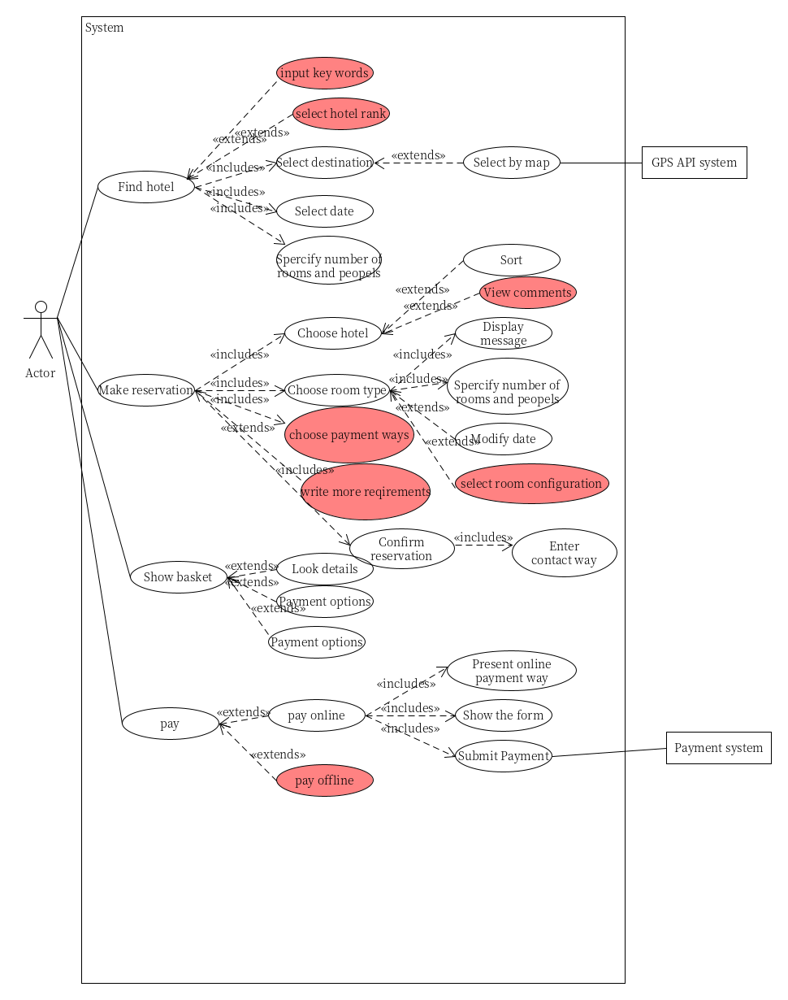

# Homework-04

用例建模 - 绘制用例图

## 用例的概念

用例是系统针对请求进行响应的行为的描述，可以说，用例是基于某种或者多种场景下的系统与用户的交互行为，简单来说，可以理解为用例就是某用户使用系统时能够进行的某操作的描述。

## 用例和场景的关系？什么是主场景或 happy path？

- 场景是什么： 场景 (scenario) 是参与者和系统之间的一系列特定的活动和交互，也称为用例实例 (use case instance)。

- 用例和场景的关系：用例 (use case)就是一组相关的成功和失败场景集合，用来描述参与者如何使用系统来实现其目标。

- 主场景： 也叫做主成功场景Main Success Scenario或者 理想路径happy path，这是用例最基本的组成部分，它描述了满足涉众关注点的典型成功路径。要注意的是，它通常不包括任何条件或分支，这是为了保持连贯性，并且将所有的条件处理都延迟到扩展部分。这种具有争议的做法更易于理解和扩展。

## 用例有哪些形式？

- 摘要
    - 摘要用例有很少的句子组成来总结的用例。它十分适合在电子表格中计划软件开发。一个摘要用例能够简单插入电子表格的单元格中并且用表格中的其它列记述业务优先级，技术复杂度，版本号等。

- 完整正式
    - 一个完整正式或者复杂的用例是一个以包含了不同部分的长模板为基础的正规的文档。

- 非正式
    - 一个非正式的用例由文本段落组成，包括了上面提到的那些列，用总结或故事的形式详细的描述了用例。

## 对于复杂业务，为什么编制完整用例非常难？

1. 首先，整个用例编写过程当中，理想路径与扩展场景相结合也只能尽可能满足“几乎”所有涉众所关注的问题，因为有些问题最好是作为非功能性需求在补充规格说明中描述，而不是直接在用例中说明。

2. 此外，由于业务的复杂性，在简单的需求讨论和短时间的开发迭代中，一定无法覆盖整个业务的所有需求，因此用例的增加也只能覆盖大部分已出现的情形，而无法完全覆盖所有情景，也就“不完整”。同时，用例可能会遗漏一些关键信息或包含错误的陈述。

## 什么是用例图？

用例图是一种优秀的系统语境图（context diagram），也就是说用例图可以展示系统边界、位于边界之外的事物以及系统如何被使用。同时，用例图可以作为沟通的工具，用以概括系统及其参与者的行为。

## 用例图的基本符号与元素？

用例图包6个元素，参与者，用例，关联关系，包含关系，扩展关系，泛化关系。

1. 参与者（actors）：表示系统中的用户，即与系统交互的对象

2. 用例（use case）：用户与系统的交互行为，可以理解为用户可以使用系统做的事情

3. 包含关系（include）：被指向的用例为发起用例的行为之一

4. 扩展关系（extend）：被指向的用例为发起用例的扩展功能

5. 泛化关系（generalization）：被指向的用例是发起用例的特例之一

6. 关联关系（association）：表示参与者与用例之间的关系

## 用例图的画法与步骤

1. 确定系统边界
    - 先使用方框画出系统边界并标记系统名称

2. 确定参与者
    - 明确参与者是谁：用户？管理员？设备？只要是使用系统产生交互的对象都是参与者
    - 在系统边界外部使用参与者符号，添加参与者信息

3. 确定用例
    - 明确系统中的用例场景都有什么：确定系统功能，确定用例之后，在系统方框内添加用例符号并标识用例信息
    - 明确参与者与用例之间的交互关系：确定参与者与用例之间的关系之后就可以使用关联关系的符号将两者相连
    - 明确用例之间的关系：明确将用例之间的关系，分别为泛化关系、包含关系、扩展关系，分别用这三种关系的符号连接相应的用例

4. 确定外部接口
    - 外部接口可能是一些API的调用，在系统方框外用其他的方框标识调用的外部api，并使用关联关系符号将接口与调用此接口的用例相连

## 用例图给利益相关人与开发者的价值有哪些？

- 用例强调了用户的目标和观点，使得用户能够更多地参与到系统的设计当中去，保证系统按照用户的需求进行设计。而用例图则将用例图形化、具象化了，使得整个系统中用例、参与者之间的关系更加清晰地表达出来。

- 用例能够根据需要对复杂程度和形式化程序进行增减调节，即能够响应用户（利益相关人)提出的需求，而用例图则使得这种调节更加便利，可以通过修改图形间的关系实现。

- 用例图使得开发者能够更明确地获得需求，更好地理解需求。

- 用例图可以指导开发和测试，同时可以在整个过程中对其他工作流起到指导作用。

## 建模练习题

### ASG_RH 旅馆预订用例

### 携程旅馆预订用例

### 为什么相似系统的用例图是相似的？

因为相似的系统中，用户预期的功能都是相似的，即不同的同类系统一定具有一致基本功能以及带有自己特色的扩展功能。

以酒店预订系统为例，使用该系统的用户一般提供时间、地点、价格等信息，利用系统来搜索出符合信息的房间并进行预定，因此所有的系统都需要包括这样的功能，才能够满足用户的需求。

### 如果是定旅馆业务，请对比 Asg_RH 用例图，简述如何利用不同时代、不同地区产品的用例图，展现、突出创新业务和技术。

1. 可以通过评价系统来使得质量好的酒店被更多人知道

2. 通过地图API更好地确定位置

3. 支持多种支付方法，并提供退款服务

### 如何利用用例图定位创新思路（业务创新、或技术创新、或商业模式创新）在系统中的作用

在用例图中提供用户评价系统，客户可以通过用户评价系统更好的了解商品的信息，因为评论都是以用户的角度进行评价，因此会让用户有安全感，增加订阅商品的可能性。 另外，我们可以提供多种支付方式，并且我们需要给用户提供支付成功的消息反馈，也增加用户的信任度和安全感，大大提升了服务的效果。

### 使用 SCRUM 方法，选择一个用例图，编制某定旅馆开发的需求（backlog）开发计划表

| ID | Name | Imp | Est | How to demo | Notes |
|:---:|:---:|:---:|:---:|:---:|:---:|
| 1 | 查找功能 | 5 | 20 | 设计查找功能 | |
| 2 | 产生订单 | 5 | 20 | 设计订单功能 | |
| 2 | 支付系统 | 5 | 100 | 根据订单信息及支付 | 需要API |

### 根据任务4，参考 使用用例点估算软件成本，给出项目用例点的估算

用例点法:

- 简单用例权重1

- 一般用例权重2

- 复杂用例权重3

| 用例 | 事务 | 计算 | UC权重 | 
|:---:|:---:|:---:|:---:|:---:| 
| 1 查询酒店 | 7 | 14 | 一般 |
| 2 预定酒店 | 6 | 12 | 一般 |
| 3 订单以及支付系统 | 6 | 18 | 复杂 | 
  
**AW=44**

用例复杂度:

- 简单权重5

- 一般 10

- 复杂 15

|用例 | 事务 | 计算 | UC权重 |
|:---:|:---:|:---:|:---:|:---:| 
|1 查询酒店 | 7 | 70 | 一般 |
|2预定酒店 | 6 | 60 | 一般|
|3 订单以及支付系统 | 6 | 90 | 复杂 |

**UCW=220**

***UUCP = AW + UCW =264***

| 权重 | 标准 |
|:---:|:---:|
| 0.8 | 代表简单, 没有技术难点，30%以上部分有参考对象 |
| 1 | 代表一般 |
| 1.2 | 代表复杂有困难,30%以上部分没有先例，需要尝试新技术，比如支持不熟悉的操作系统 |

**TCF = 1 Size = UUCP * TCF = 1 * 261 = 261**

| 权重 | 标准
|:---:|:---:|
| 0.8 | 代表主要开发人员熟悉类似项目，开发者必须有2年以上的项目经历或作为技术负责人（或主要参与人）经历二个相似项目 |
| 1 | 开发者必须有1年以上的项目经历或作为技术负责人（或主要参与人）经历至少一个相似项目 |
| 1.2 | 开发者只有不到1年的项目经历，或没有项目经历，并且没有作为技术负责人经历相似项目 |

每一步有2 技术负责人 1个熟悉类似项目的参与人还有3个项目经历少的新人

EF = 3 ×（１×０.８＋２＊１＋３＊１２/18）＝１.06

***AUCP = SIZE*ECF=276.67***