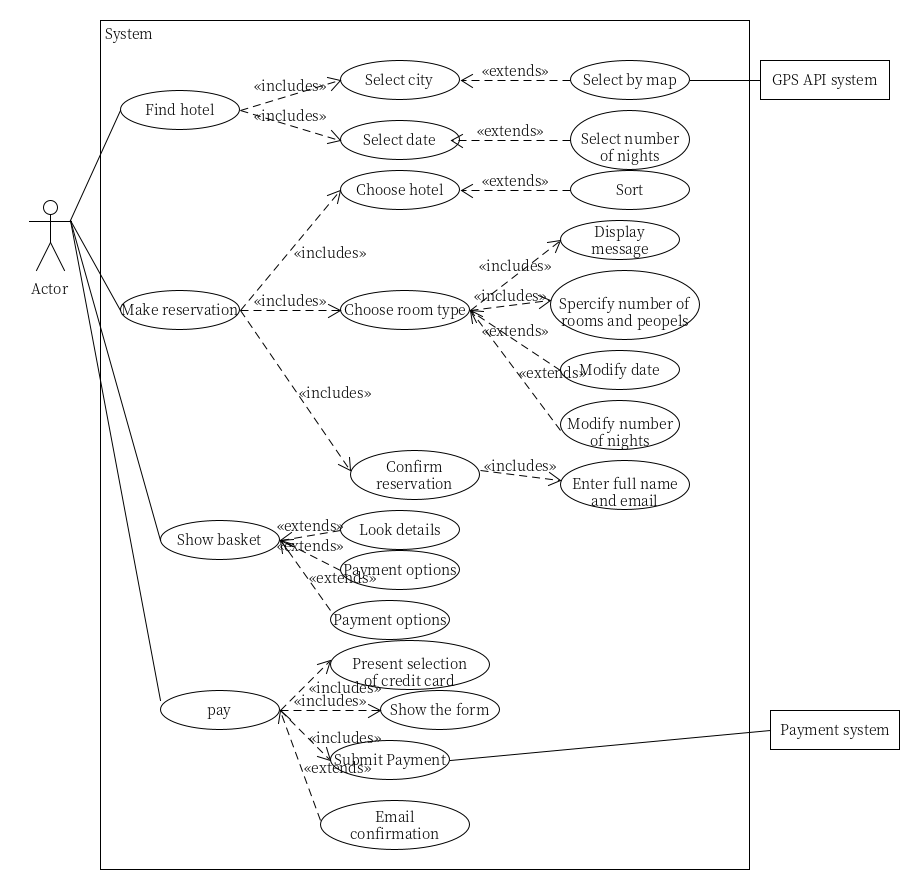
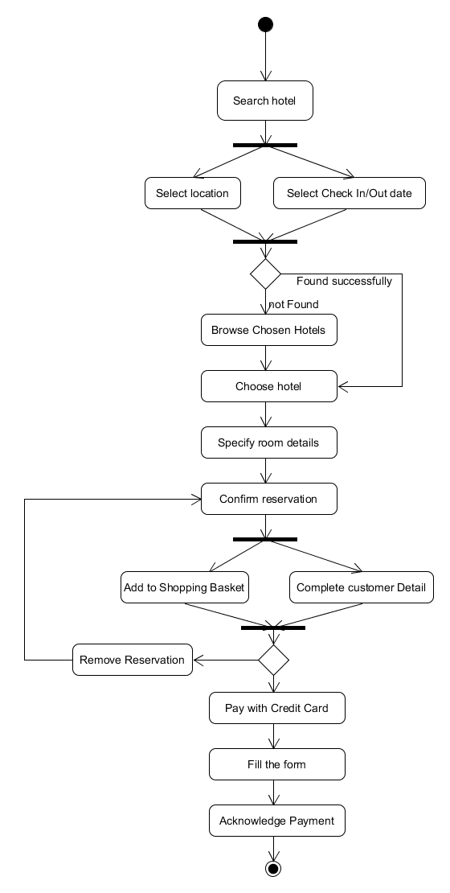
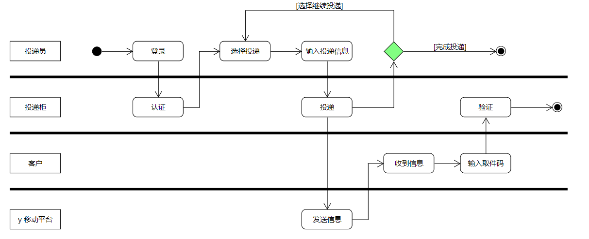
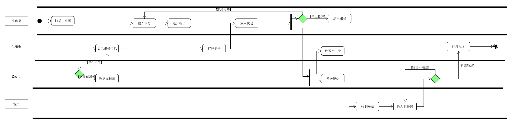
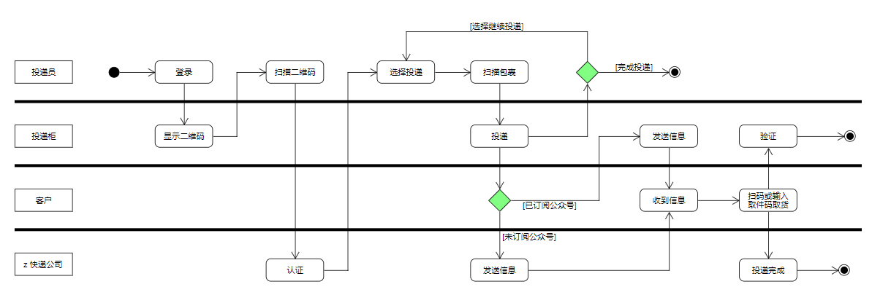
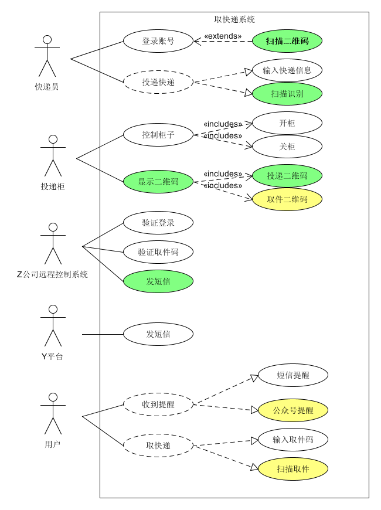

# Homework-05

UML 建模

## 根据订旅馆建模文档，Asg-RH.pdf，进行建模

### 绘制用例图模型（到子用例）

**分析：**

在完成阅读完给定的PDF文件后，可以简单归纳出以下的用例和子用例的结构关系，大致把顾客的操作分为四大类，而这四大类操作又可以继续进行划分：

- 搜索旅馆
    - 输入城市信息
    - 输入日期信息
    - 排序
    - 推荐

- 预定旅馆
    - 搜索旅馆
    - 选择旅馆
        - 查看详情
    - 选择房间类型
    - 确定预定（加入购物车）
        - 完善客户信息

- 购物车
    - 添加商品
    - 完善预定商品信息
    - 选择付款
    - 移除商品

- 支付
    - 选择支付账户
        - 调用外部API
    - 完善账户信息

**作图**

### 给出 make reservation 用例的活动图

## 根据课程练习“投递员使用投递箱给收件人快递包裹”的业务场景

### 场景 1

#### 场景

x 科技公司发明了投递柜，它们自建了投递柜以及远程控制系统。注册的投递员在推广期免费使用投递柜。由于缺乏资源，仅能使用 y 移动平台向客户发送短信通知。

#### 图示

### 场景 2

#### 场景

随着产品推广，x 公司与各大快递 z 公司达成协议。x 公司在快递柜上添加了二维码扫描装置，z 公司的快递员不仅可在快递柜上登陆（由 z 公司提供认证服务），且可扫描快递单号，投递入柜后自动由 z 公司发短信给客户。客户取件后，自动发送给 z 公司投递完成。

#### 图示

### 场景 3

#### 场景

x 公司进一步优化服务，开发了微信小程序实现扫码取快递。如果用户关注了该公司公众号，直接通过过公众号推送给用户取件码等信息。不再发送短信。

#### 图示

### 根据上述流程，给出快递柜系统最终的用例图模型

- 用正常色彩表示第一个业务流程反映的用例

- 用绿色背景表述第二个业务场景添加或修改的用例，以及支持 Actor

- 用黄色背景表述第三个业务场景添加或修改的用例，以及支持 Actor

