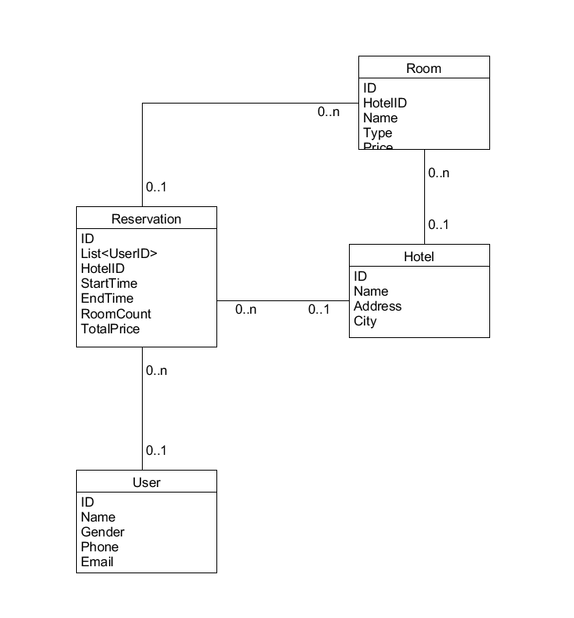
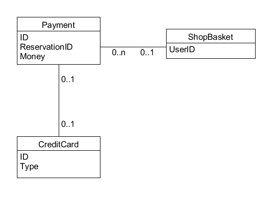

# Homework-06

UML 建模 2

## 领域建模

使用类图，分别对 Asg_RH 文档中 Make Reservation 用例以及 Payment 用例开展领域建模。然后，根据上述模型，给出建议的数据表以及主要字段，特别是主键和外键

- 注意事项：
    - 对象必须是名词、特别是技术名词、报表、描述类的处理；
    - 关联必须有多重性、部分有名称与导航方向
    - 属性要注意计算字段

- 数据建模，为了简化描述仅需要给出表清单，例如：
    - Hotel（ID/Key，Name，LoctionID/Fkey，Address…..）

### MakeReservation

#### 图示

#### 数据表与主要字段

- Customer(ID/key, FullName, EmailAdress)

- City(ID/key, Name)

- Hotel(ID/key, Name, Adress, CityID/Fkey)

- Room(RoomID/key, HotelID/Fkey, Type, Availability)

- ReservationItem(ID/key, RoomID/Fkey, BasketID/Fkey, checkInDate, checkOutDate, NumberOfAdults, NumberOfChildren, Price, IsSmoking)

- ReservationBasket(ID/key, CustomerID/Key)

### Payment

#### 图示

#### 数据表与主要字段

- Payment(ID/key, totalPrice, reservationID/Fkey, cardID/Fkey)

- ReservationItem(ID/key, paymentID/Fkey,checkInDate, ...)

- CreditCard(ID/key, Type, CardSecurityCode, ExpiryDate, CardHolderID/Fkey)

- CardHolder(ID/key, Title, FirstName, LastName, Address1, Address2, City, CountyOrState, Country, Postcode, DaytimeTelephone, EveningTelephone)

## 生命周期建模

使用 UML State Model，对每个订单对象生命周期建模

- 建模对象： 参考 Asg_RH 文档， 对 Reservation/Order 对象建模。

- 建模要求： 参考练习不能提供足够信息帮助你对订单对象建模，请参考现在 定旅馆 的旅游网站，尽可能分析围绕订单发生的各种情况，直到订单通过销售事件（柜台销售）结束订单。

### 分析

常见事件有：

- 预定旅馆
- 未支付订单，取消预定
- 对旅馆进行排序
- 支付订单，取消预定
- 选择信用卡
- 未找到旅馆
- 信息反馈（所有方法均未找到旅馆后使用）

主要状态有：

- 正在查找旅馆
- 正在选取房间
- 待完善并确认信息
- 待提交订单
- 待支付订单
- 待入住
- 退款中
- 已入住

### 图例

